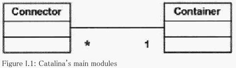

# 概要介绍

## Servlet 容器是如何工作的

- 创建一个`request`对象并填充有可能被引用的servlet使用的信息,如参数、头部、cookies、查询字符串、URI等等。
- 创建一个`response`对象，所引用的servlet使用它来给客户端发送响应。
- 调用`servlet`的`service`方法，并传入`request`和`response`对象。在这里`servlet`会从`request`对象取值，向`response`对象写值

