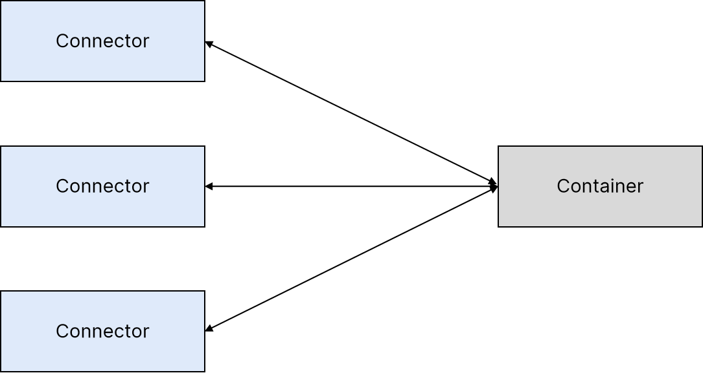

# 概要介绍

> 针对`Tomcat4.1.12`和`5.0.18`版本，代号`Catalina`

## Servlet 容器是如何工作的

### servlet容器为servlet请求提供服务的流程

1. 创建一个`request`对象并填充有可能被引用的servlet使用的信息,如参数、头部、cookies、查询字符串、URI等等。
2. 创建一个`response`对象，所引用的servlet使用它来给客户端发送响应。
3. 调用`servlet`的`service`方法，并传入`request`和`response`对象。在这里`servlet`会从`request`对象取值，向`response`对象写值

### Catalina架构
Catalina可以看作由两个主要模块组成: 连接器（connector）和容器（container）

连接器用于“连接”容器里的请求，对于接收到的每一个`HTTP`请求构造一个`request`对象和一个`response`对象，然后把流程传递给容器。

容器从连接器接收到`request`和`response`对象之后调用`servlet`的`service`方法用于响应。
